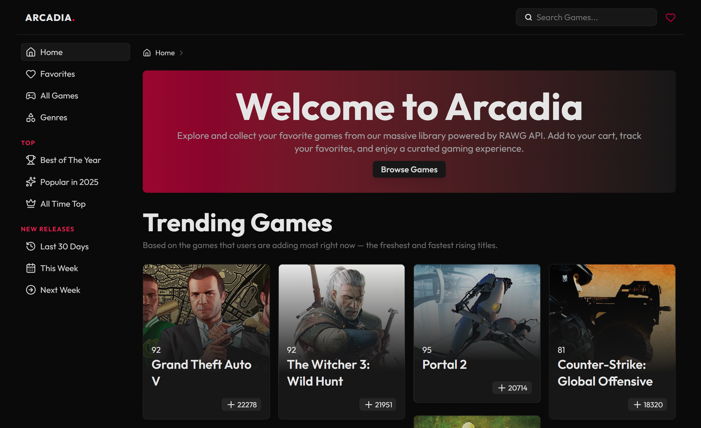
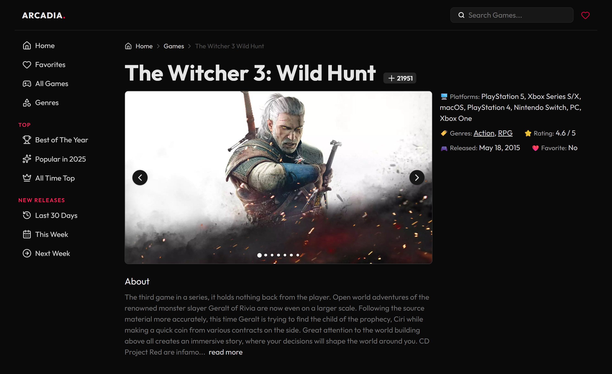
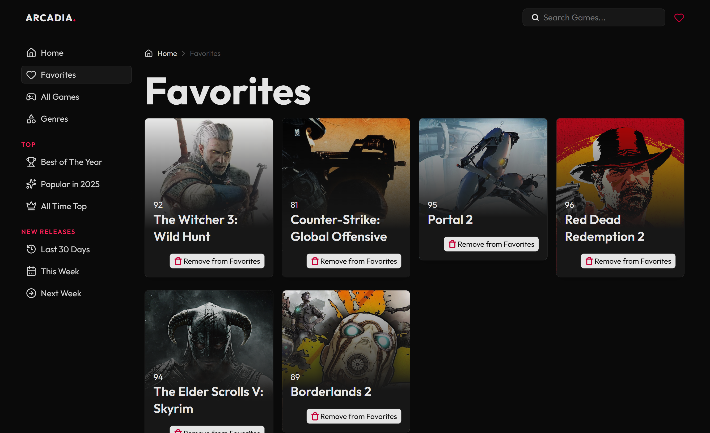

# 🎮 Arcadia

Discover, explore, and track your next favorite video game.  
**Arcadia** is a modern video game discovery app built with **React 19**, **Vite**, and the **RAWG Video Games API**.

🌐 **Live Demo:** [arcadiagamesx.vercel.app](https://arcadiagamesx.vercel.app/)

---

## 🖼️ Preview

| Home                                        | Game Details                                           |
| ------------------------------------------- | ------------------------------------------------------ |
|  |  |

---

## 🧭 Overview

**Arcadia** is your gateway to the world of gaming.  
Browse trending, upcoming, and top-rated games — search across genres, view details, and build your personal **favorites collection**.

Built as part of [The Odin Project](https://www.theodinproject.com/), Arcadia focuses on:

- Modular, scalable React architecture
- Optimized API fetching and caching
- Smooth user experience with infinite scroll and responsive design
- Local persistence for your favorite games

## ✨ Features

- ⚙️ **Powered by RAWG API** — live video game data
- ♾️ **Infinite Scroll** for seamless discovery
- 🔍 **Smart Search** — find any game instantly
- ❤️ **Favorites System** with localStorage + tab sync
- 🧭 **Genre-Based Browsing** and curated Discover sections
- 🧩 **React Query** for caching and pagination
- 🪶 **Modern UI** built with TailwindCSS v4
- 📜 **Breadcrumb Navigation** and clean route transitions
- 📱 **Fully Responsive** for all devices

---

## 🧰 Tech Stack

| Category             | Tools                               |
| -------------------- | ----------------------------------- |
| **Frontend**         | React 19 + Vite                     |
| **Routing**          | React Router v7                     |
| **Data Fetching**    | @tanstack/react-query               |
| **State Management** | useSyncExternalStore (custom store) |
| **Styling**          | TailwindCSS v4 + Prettier Plugin    |
| **Icons**            | lucide-react                        |
| **API**              | RAWG.io API                         |
| **Utilities**        | date-fns, react-masonry-css         |
| **Deployment**       | Vercel                              |

---

## 📂 Folder Structure

```text
.
└── src/
    ├── components/ # Reusable UI elements (GameCard, Gallery, etc.)
    ├── hooks/ # Custom hooks (useGamesQuery, useFavorites)
    ├── layout/ # Layout components (Header, Sidebar, ScrollToTop)
    ├── pages/ # Page-level components (Home, Genres, Discover, etc.)
    ├── services/ # RAWG API logic
    ├── stores/ # Custom global store for favorites
    ├── utils/ # Static config & helpers
    ├── App.jsx # Root app structure
    └── main.jsx # Entry point
```

---

## ⚙️ Setup Instructions

### 1. Clone the repository

```bash
git clone https://github.com/devxsameer/arcadia.git
cd arcadia
```

### 2. Install dependencies

```bash
pnpm install
```

### 3. Create a .env file

```js
VITE_RAWG_KEY = your_rawg_api_key_here;
```

Get your key from RAWG.io

### 4. Run the development server

```bash
pnpm run dev
```

### 5. Build for production

```bash
pnpm run build
```

---

## 🧩 Core Highlights

### ⚡ Smart Infinite Scrolling

Powered by React Query’s useInfiniteQuery:

```js
const { data, fetchNextPage, hasNextPage, isFetchingNextPage } =
  useInfiniteQuery({
    queryKey: ['games', params],
    queryFn: ({ pageParam = 1 }) =>
      fetchGames({ ...params, page: pageParam }),
    getNextPageParam: (lastPage, allPages) =>
      lastPage.next ? allPages.length + 1 : undefined,
  });
```

### ❤️ Custom Favorite Store

Lightweight local store synchronized across tabs:

---

## 🧠 Pages Overview

| Page             | Description                                               |
| ---------------- | --------------------------------------------------------- |
| **Home**         | Browse trending and top games                             |
| **Discover**     | Curated sections: This Week, Upcoming, Top Rated, etc.    |
| **Genres**       | Explore games by category                                 |
| **Favorites**    | Manage and view favorited games                           |
| **Search**       | Find games by title                                       |
| **Game Details** | Full info — ratings, screenshots, genres, and description |

---

## 🖌️ Design & UI

- Built entirely with TailwindCSS v4
- Dark aesthetic, subtle gradients, and modern typography
- Responsive grid via `react-masonry-css`
- Smooth transitions and hover animations
- Lazy loading for images

---

## 🚀 Deployment

Deployed with Vercel

🔗 **Live Demo:** [arcadiagamesx.vercel.app](https://arcadiagamesx.vercel.app/)

---

## 📸 Screenshots




---

## 🧾 Credits

- 🎓 [The Odin Project](https://www.theodinproject.com/) — guidance & structure
- 🎮 [RAWG.io Api](https://rawg.io/apidocs) — game data source
- 🧩 [lucide-react](https://lucide.dev/) — icons

---

## 🧑‍💻 Author

**Sameer Ali**  
Frontend Developer | React Enthusiast | Building modern web experiences

- 🐙 [Github](https://github.com/devxsameer)
- 💼 [LinkedIn](https://www.linkedin.com/in/devxsameer/)

---

## ⭐ Support

If you liked **Arcadia**, give it a ⭐ on GitHub — it helps support open-source learning and inspires more projects like this!

---

🎮 “Arcadia — where discovery meets design.”
