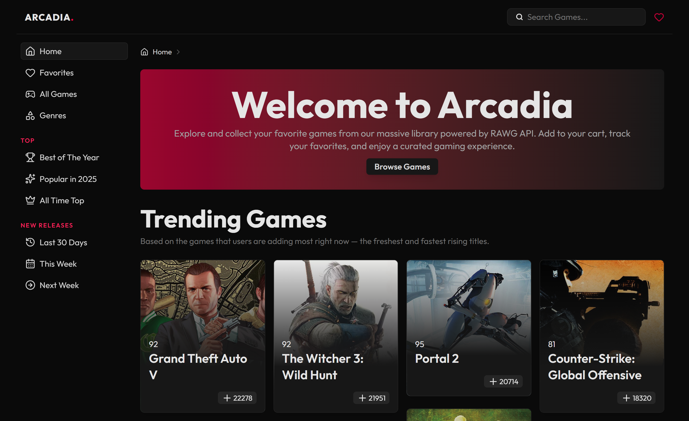
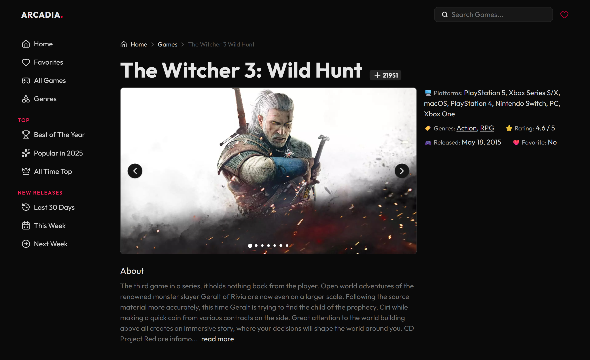
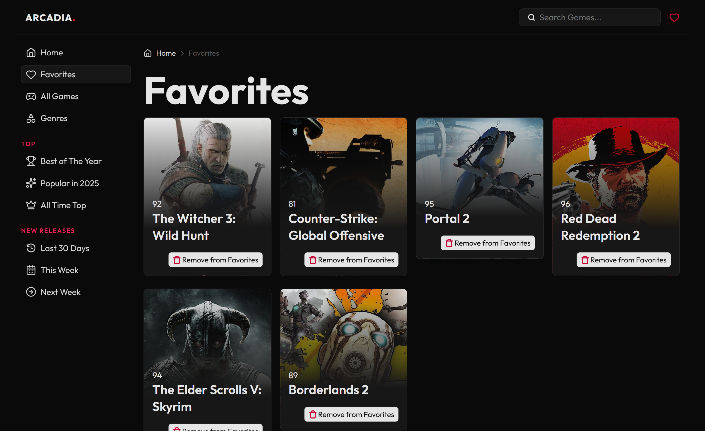

# 🎮 Arcadia

Discover, explore, and track your next favorite video game.  
**Arcadia** is a modern video game discovery app built with **React 19**, **Vite**, and the **RAWG Video Games API**.

🌐 **Live Demo:** [arcadia.devxsameer.me](https://arcadia.devxsameer.me)

---

## 🖼️ Preview

| Home                                        | Game Details                                           |
| ------------------------------------------- | ------------------------------------------------------ |
|  |  |

---

## 🧭 Overview

**Arcadia** is a production-style video game discovery platform built using modern React architecture principles.

Originally inspired by _The Odin Project_, this project was intentionally taken beyond tutorial scope — with a focus on **scalability, separation of concerns, and real-world frontend patterns**, including feature-based architecture, centralized data fetching, and route-level code splitting.

## ✨ Features

- ⚙️ **Powered by RAWG API** — live video game data
- ♾️ **Infinite Scroll** for seamless discovery
- 🔍 **Smart Search** — find any game instantly
- ❤️ **Favorites System** with persistent storage & cross-tab synchronization
- 🧭 **Genre-Based Browsing** and curated Discover sections
- 🧩 **TanStack React Query** for caching, pagination, and request deduplication
- 🪶 **Modern UI** built with TailwindCSS v4
- 📜 **Breadcrumb Navigation** and clean route transitions
- 📱 **Fully Responsive** for all devices

---

## 🧰 Tech Stack

| Category             | Tools                               |
| -------------------- | ----------------------------------- |
| **Architecture**     | Feature-based frontend architecture |
| **Frontend**         | React 19 + Vite                     |
| **Routing**          | React Router v7                     |
| **Data Fetching**    | @tanstack/react-query               |
| **State Management** | React Context + custom hooks        |
| **Styling**          | TailwindCSS v4 + Prettier Plugin    |
| **Icons**            | lucide-react                        |
| **API**              | RAWG.io API                         |
| **Utilities**        | date-fns, react-masonry-css         |
| **Deployment**       | Vercel                              |

---

## 🏗️ Architecture Decisions

- Adopted **feature-based folder structure** to improve scalability and maintainability
- Centralized API communication via a reusable API client
- Isolated shared UI and hooks from feature-specific logic
- Used provider composition (`AppProviders`) for clean app bootstrapping
- Implemented route-level code splitting for performance

This architecture allows features to evolve independently without increasing coupling.

---

## 📂 Folder Structure

```text
src/
├── app/                 # App bootstrap (router, providers)
├── features/            # Feature-based domains (games, genres, favorites)
│   ├── games/
│   │   ├── api/
│   │   ├── components/
│   │   ├── hooks/
│   │   └── pages/
│   ├── genres/
│   ├── favorites/
│   └── discover/
├── layout/              # App shell (Header, Sidebar, ScrollToTop)
├── shared/              # Reusable UI, hooks, and utilities
│   ├── components/
│   ├── hooks/
│   └── utils/
├── lib/                 # App-wide infrastructure (API client, env, queryClient)
├── styles/              # Global styles & Tailwind setup
└── main.jsx             # Application entry point

```

---

## ⚙️ Setup Instructions

### 1. Clone the repository

```bash
git clone https://github.com/devxsameer/arcadia.git
cd arcadia
```

### 2. Install dependencies

```bash
pnpm install
```

### 3. Create a .env file

```js
VITE_RAWG_KEY = your_rawg_api_key_here;
```

Get your key from RAWG.io

### 4. Run the development server

```bash
pnpm run dev
```

### 5. Build for production

```bash
pnpm run build
```

---

## 🧩 Core Highlights

### ⚡ Smart Infinite Scrolling

Powered by React Query’s useInfiniteQuery:

```js
const { data, fetchNextPage, hasNextPage, isFetchingNextPage } =
  useInfiniteQuery({
    queryKey: gameKeys.list(params),
    queryFn: ({ pageParam = 1 }) =>
      fetchGames({ ...params, page: pageParam }),
    getNextPageParam: (lastPage, allPages) =>
      lastPage.next ? allPages.length + 1 : undefined,
  });
```

Query keys are centralized to ensure consistency and predictable cache behavior.

### ❤️ Custom Favorite Store

Lightweight local store synchronized across tabs:

---

## 🧠 Pages Overview

| Page             | Description                                               |
| ---------------- | --------------------------------------------------------- |
| **Home**         | Browse trending and top games                             |
| **Discover**     | Curated sections: This Week, Upcoming, Top Rated, etc.    |
| **Genres**       | Explore games by category                                 |
| **Favorites**    | Manage and view favorited games                           |
| **Search**       | Find games by title                                       |
| **Game Details** | Full info — ratings, screenshots, genres, and description |

---

## 🖌️ Design & UI

- Built entirely with TailwindCSS v4
- Dark aesthetic, subtle gradients, and modern typography
- Responsive grid via `react-masonry-css`
- Smooth transitions and hover animations
- Lazy loading for images

---

## 🚀 Deployment

Deployed with Vercel

🔗 **Live Demo:** [arcadia.devxsameer.me](https://arcadia.devxsameer.me)

---

## 📸 Screenshots




---

## 🧾 Credits

- 🎓 [The Odin Project](https://www.theodinproject.com/) — guidance & structure
- 🎮 [RAWG.io Api](https://rawg.io/apidocs) — game data source
- 🧩 [lucide-react](https://lucide.dev/) — icons

---

## 🧠 What I Learned

- Designing scalable frontend architecture beyond tutorials
- Managing complex async data flows with React Query
- Structuring large React apps using domain-driven patterns
- Improving UX through loading states, caching, and infinite scrolling
- Balancing UI polish with maintainable code

## 🧑‍💻 Author

**Sameer Ali**  
Frontend Developer | React Enthusiast | Building modern web experiences

- 🌐 [Portfolio](https://devxsameer.me)
- 🐙 [GitHub](https://github.com/devxsameer)
- 💼 [LinkedIn](https://www.linkedin.com/in/devxsameer/)

---

## ⭐ Support

If you liked **Arcadia**, give it a ⭐ on GitHub — it helps support open-source learning and inspires more projects like this!

---

🎮 “Arcadia — where discovery meets design.”
